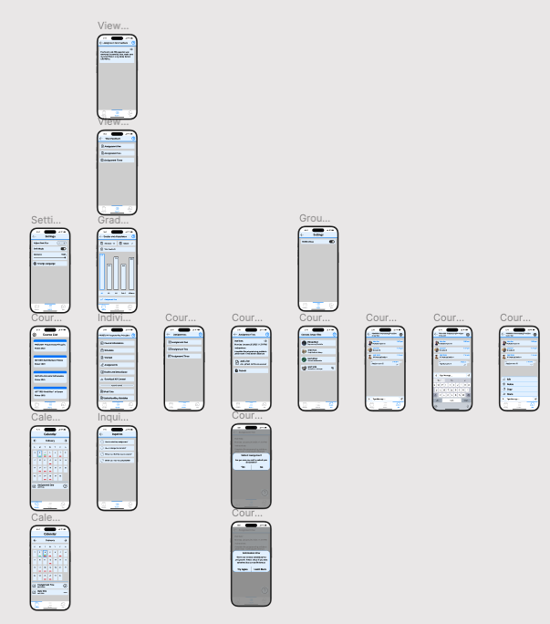

# Muhammad Choudhary HCI Assignment 3

## About

This git repo is for the prototype for HCI assignment 2. Most if not all student have a smart phone and use it more than computers. This app is designed for students to access all the course content from their smart phones.
I will also help students to stay productive because they can easily use their phone instead of computers to access the course content.

## Links

- [Link to Figma Design](https://www.figma.com/design/0mlaBtG5eJV11L8ooeiEgF/muhammad_choudhary_a3?node-id=0-1&t=nZly3j39FpJRPr1d-1)
- [Link to Github Repository]()
- [Recorded video for Participant Number One and Two](https://youtu.be/AXUr6qxddNw)

## 🔥 Here are my top five functionalities of my app:

- View course materials such as lecture notes and slides
- Submit assignments
- Each course has a dedicated group chat where students can discuss amongst each other
- Calendar to view all upcoming assignments and quizzes
- View grades and feedback: Students can view grades and feedback for specific assignments

# Final Prototype

# Navigation of Final Prototype

